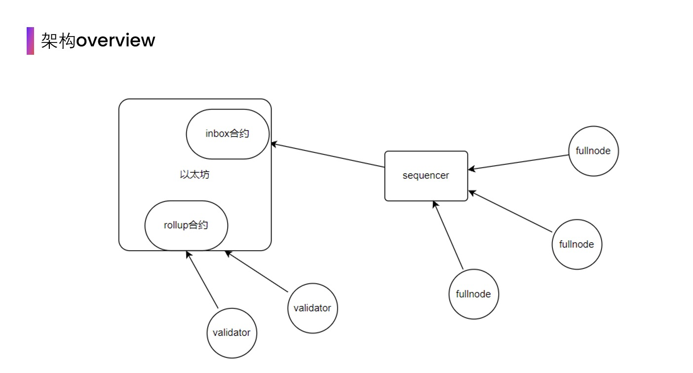

# Arbitrum节点工作流

在arbitrum中，节点有多种类型，而在arbitrum one中，最主要的为sequencer, validator和fullnode, 这三种节点的分工为：

- sequencer：拥有排序交易的权限，由于可以排序交易，因此可以在收到用户的请求后直接将用户的交易定序，由于交易被定序后，就知道了交易的前序状态（既然此交易被定序，那么之前的交易也被定序了，也就能按照之前的交易顺序执行出状态结果），再加上该交易的运行，便可获得该交易执行后的状态，因此可以立即将执行结果返回给用户。同时sequencer也负责将l2的交易摘要发送给l1.
- validator：对状态进行质押。在sequencer将交易定序后，用户可以直接相信sequencer的结果，但sequencer不对执行结果做保证（只对顺序做保证），因此需要一方来对交易结果做保证，而这一方则是validator。
- fullnode：与其他网络的fullnode一样，可以在本地验证交易，也可以转发交易，但是没有出快权。

我们可以在下方看到这三种节点的工作流：

  

在上图中，我们可以把arbitrum one中的工作流分为两个部分，一个是以inbox合约为流程的，另一个是由rollup合约为流程的，而这两个部分分别对应了两种类型的链：Sequencer链和Rollup链。

## Sequencer chain
Sequencer Chain指的是Sequencer（定序器，对二层交易进行打包排序的全节点，相当于二层网络的出块节点，不同于其他的layer1网络，Sequencer节点不需要通过共识算法来竞争出块权，而是直接具有打包区块的权力，目前Arbitrum的Sequencer由官方运行，出块权完全由官方掌握）对Rollup中交易进行打包进layer2区块并用链式结构连接起来的区块链，其数据结构和一般区块链的数据结构类似，Layer2的交易数据都通过Sequencer Chain来储存，用户发起一笔交易，通过RPC（远程过程调用）将交易发送给RPC node，RPC node再转发给Sequencer节点，Sequencer在接收到用户的交易之后立即对交易进行打包处理，实现layer2交易的初级确认。在收集到一段时间内的交易以后，Sequencer会将这段时间内的交易组成一个批次，经过压缩以后以calldata的形式将交易数据上传到Arbitrum部署在以太坊Layer1的Sequencer inbox合约中，以实现将数据可用性放在以太坊主网，而将执行迁移到layer2的设计，至此，实现了layer2的第二步确认。

## Rollup chain
前文我们提到，layer2的交易在Sequencer被打包以后以calldata的形式传到layer1的inbox合约中，那谁来替我们验证存到layer1的数据是否是真实的呢，Sequencer在上传的时候是否加入了虚假交易，这个时候就得说到Optimistic Rollup特殊的欺诈证明机制了。Sequncer传到inbox合约的数据都是公开透明的，可以被全网的参与者监督，这也是欺诈证明的基础。因为作恶者永远不知道有多少参与者在监督着链上的数据。这时候引入了另外一条链，即Rollup Chain，你也可以将之称为验证者链。每一个人在条件允许的情况下，都可以根据inbox合约中的calldata数据在自己的本地运行一条Sequencer链，因为inbox合约中的数据是还原layer2状态的最少数据，人们可以在本地运行所有的交易，以确保Sequencer没有作恶，但是真的要所有人来维护Arbitrum状态吗？显然是不可能的，只有类似交易所这样在Arbitrum拥有大量资产的参与者会自己在本地来维护Arbitrum状态，来确保自己的资产在Arbitrum是安全的。这就是为什么说会有很多的Sequencer Chain的原因，只不过仅有Sequencer自己运行的那条Sequencer链才是主要维持网络的链。而Rollup Chian则是网络中的验证者对于网络状态质押产生的链，其运行在以太坊主网，比方说在一段时间内，验证者会对Sequencer上传到Inbox合约中的状态进行质押，即验证者押注正确的交易，通过质押ETH发布断言，声称质押这段交易历史是正确的，如果所有的交易都是正确的，那么链的状态将会持续推进更新，可如果此时有人做恶，质押了错误的交易状态，这个时候网络中的正确验证者和作恶者产生冲突，正义验证者会押注正确的状态，此时Rollup chain出现分歧，正义验证者和作恶者通过类似二分法的方式找到存在争议的交易，查找争议交易数据的这些操作在layer2执行，当明确争议区间以后，由部署在layer1的Rollup合约重新执行争议交易，并裁决双方的断言，最后作恶者会被罚没质押的ETH，其中的一部分会奖励给正义验证者，以奖励其对网络的保护。为了防止作恶者攻击网络，罚没的ETH会有一部分销毁，防止正义验证者和作恶者串通，零成本攻击网络。而这就是Rollup Chain和欺诈证明。简单叙述就是网络中的众多参与者都在本地运行完整的layer2的状态，当发现有恶意交易企图篡改链的状态的时候，众多参与者会通过欺诈证明推进链的状态朝着正确的方向前进，而欺诈证明的挑战期为7天，7天以后交易状态确认，无法再进行修改。这是layer2交易的第三级确认，在以太坊主网不分叉的前提下，第三级确认即为layer2交易的最终确认状态。

特别感谢社区爱好者0xCryptolee对参与此文的贡献。