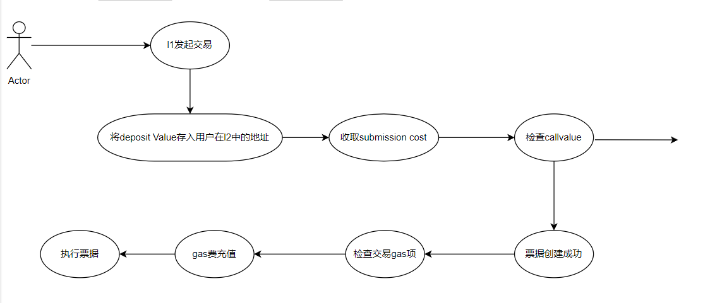
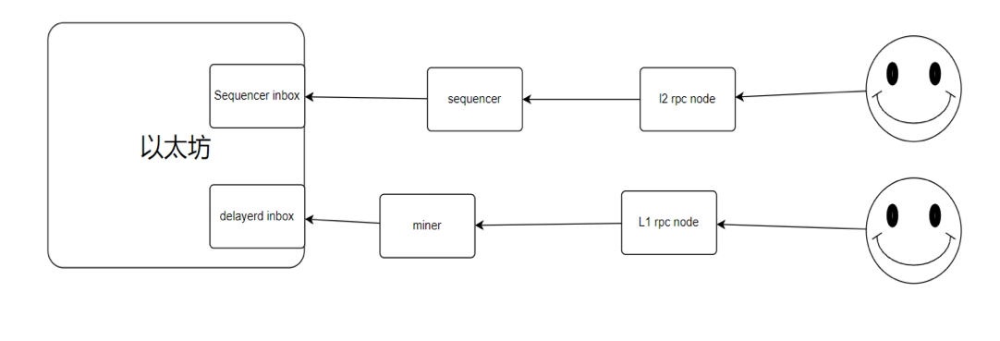

# Arbitrum inbox信息流程详解
Arbitrum是建立在l1之上的l2网络，直接根植以太坊的安全性，除此之外，arbitrum选择使用Ethereum作为结算层，因此，自然涉及到资产在l2与l1之间的转换。而这其中，从l1到l2的资产转移合约为Inbox合约（Inbox合约除资产转移之外还有其他功能），本文将从代码层面讲解Inbox合约。
合约源代码仓库[传送门](https://github.com/OffchainLabs/nitro/blob/master/contracts/src/bridge/Inbox.sol)
## Message Type
```
uint8 constant L2_MSG = 3;
uint8 constant L1MessageType_L2FundedByL1 = 7;
uint8 constant L1MessageType_submitRetryableTx = 9;
uint8 constant L1MessageType_ethDeposit = 12;
uint8 constant L1MessageType_batchPostingReport = 13;
uint8 constant L2MessageType_unsignedEOATx = 0;
uint8 constant L2MessageType_unsignedContractTx = 1;

uint8 constant ROLLUP_PROTOCOL_EVENT_TYPE = 8;
uint8 constant INITIALIZATION_MSG_TYPE = 11;
```
如上所示，l2中消息类型有多种，每种对应不同消息类型，关系详细解释，由于[官网](https://developer.offchainlabs.com/docs/arbos_formats#incoming-messages)已有阐述，因此本文不再复述。
## Deposit Eth
```
    /// @notice deposit eth from L1 to L2
    /// @dev this does not trigger the fallback function when receiving in the L2 side.
    /// Look into retryable tickets if you are interested in this functionality.
    /// @dev this function should not be called inside contract constructors
    function depositEth() public payable override whenNotPaused onlyAllowed returns (uint256) {
        address dest = msg.sender;

        // solhint-disable-next-line avoid-tx-origin
        if (AddressUpgradeable.isContract(msg.sender) || tx.origin != msg.sender) {
            // 如果该合约函数在被任意constructor执行时调用，那么isContract的检查将会失败，因此需要加入对tx.orgin的检查 
            // 我们不会调整来自 L1 合约的调用的地址，因为它们的地址被重新映射
            // 如果调用者是外部地址账户，那么我们将对其地址进行反向映射
            // 这是必需的，因为到 L2 的未签名消息（例如可重试）将会在发送到l2时对调用者地址进行映射
            // 如果我们先进性反映射，那么之后消息到达l2后将会是原本的调用者地址
            dest = AddressAliasHelper.applyL1ToL2Alias(msg.sender);
        }

        return
            _deliverMessage(
                L1MessageType_ethDeposit,
                msg.sender,
                abi.encodePacked(dest, msg.value)
            );
    }
```
该函数最关键处为对地址的映射调整步骤（可见上述代码中的中文注释），至于为什么消息在l1到l2时会对地址进行映射，推荐阅读[英文官网](https://developer.offchainlabs.com/docs/l1_l2_messages#address-aliasing)或是相关[分享视频](https://www.youtube.com/watch?v=sYo8DXvysJI)（中文）

之后，我们可以看到`_deliverMessage`里规范了消息类型(L1MessageType_ethDeposit)，发送人地址和交易信息。
注：由于deposit eth不涉及到合约执行，且非转账（直接充值入dest地址），因此不会涉及到交易失败，因此nitro升级后deposit eth将被剥离出retryable类型。


## Retryable Ticket
可重试票证是arbitrum中使用来应对l1->l2消息中可能失败的场景，如在发起l1->l2 erc20转账时，有可能会因为一系列原因失败，但此时用户已在l1中向合约发送资产，如不能重新执行，则有可能使得用户代币丢失，因此我们设计了可重试票据，下面来看其工作流程：
```
function createRetryableTicket(
        address to,
        uint256 l2CallValue,
        uint256 maxSubmissionCost,
        address excessFeeRefundAddress,
        address callValueRefundAddress,
        uint256 gasLimit,
        uint256 maxFeePerGas,
        bytes calldata data
    ) external payable virtual override whenNotPaused onlyAllowed returns (uint256) {
        // 保证交易过程中的msg.value足够支付交易中的其他费用
        if (msg.value < (maxSubmissionCost + l2CallValue + gasLimit * maxFeePerGas)) {
            revert InsufficientValue(
                maxSubmissionCost + l2CallValue + gasLimit * maxFeePerGas,
                msg.value
            );
        }

        // 如果refund地址是合约地址，我们将对其进行映射
        // 因此该合约将可以操控其在l2中的资产
        // 这是由于refund地址在传送的我过程中不会映射，因此需要在此手动映射
        if (AddressUpgradeable.isContract(excessFeeRefundAddress)) {
            excessFeeRefundAddress = AddressAliasHelper.applyL1ToL2Alias(excessFeeRefundAddress);
        }
        if (AddressUpgradeable.isContract(callValueRefundAddress)) {
            // this is the beneficiary. be careful since this is the address that can cancel the retryable in the L2
            callValueRefundAddress = AddressAliasHelper.applyL1ToL2Alias(callValueRefundAddress);
        }

        return
            unsafeCreateRetryableTicket(
                to,
                l2CallValue,
                maxSubmissionCost,
                excessFeeRefundAddress,
                callValueRefundAddress,
                gasLimit,
                maxFeePerGas,
                data
            );
    }

```
可以看见，在发送可重试票据时，主要是做一些基础检查，以及地址映射。
除此之外，retryable的生命周期如下：


<p align="center">
  
</p>

## delayed inbox
delayed inbox是用户在sequencer无法连接或不信任sequencer时所会用到的一种方案。在正常的l2场景中，用户将交易发送给全节点，如果此时，因为各种原因，无法通过sequencer发送交易，那么用户可选择第二种方法：直接发送至delayed inbox，如下：

<p align="center">
  
</p>

该方法原理是因为l2中所有交易都需要提取其摘要以calldata形式进入l1，因此除sequencer外，用户也可直接采取这种方式，具体调用函数为：

```
function sendL2Message(bytes calldata messageData)
        external
        override
        whenNotPaused
        onlyAllowed
        returns (uint256)
    {
        return _deliverMessage(L2_MSG, msg.sender, messageData);
    }
```

这与之前提到的l1->l2消息不同，这种方式为原生的l2交易，且不会对sender地址进行映射，但不同是发送的messageData必须是通过私钥进行签名过的交易数据。
