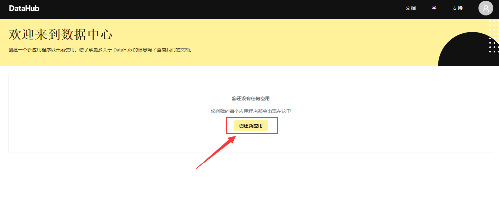
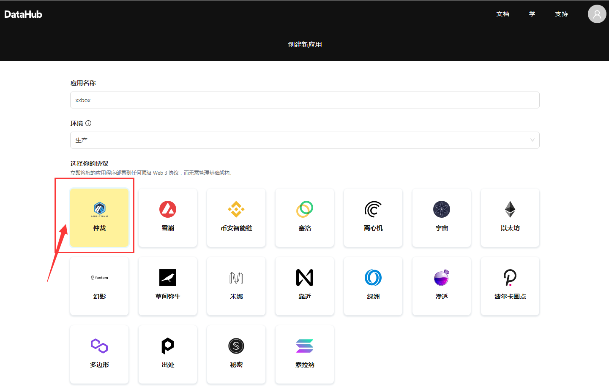
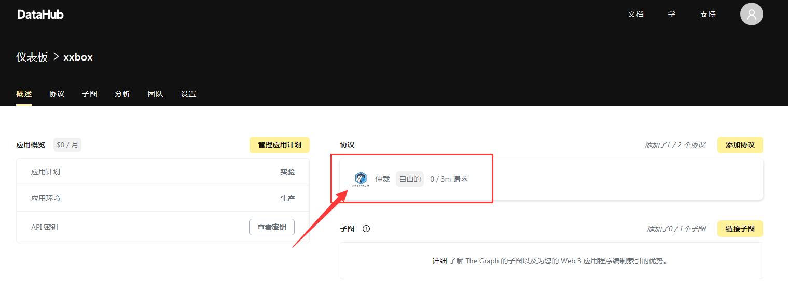
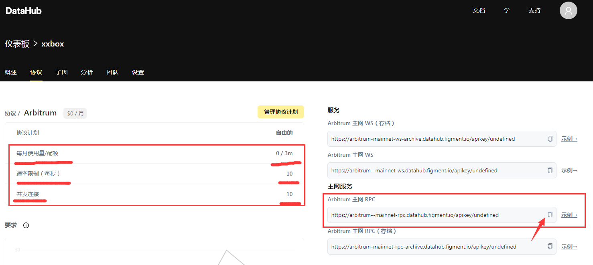
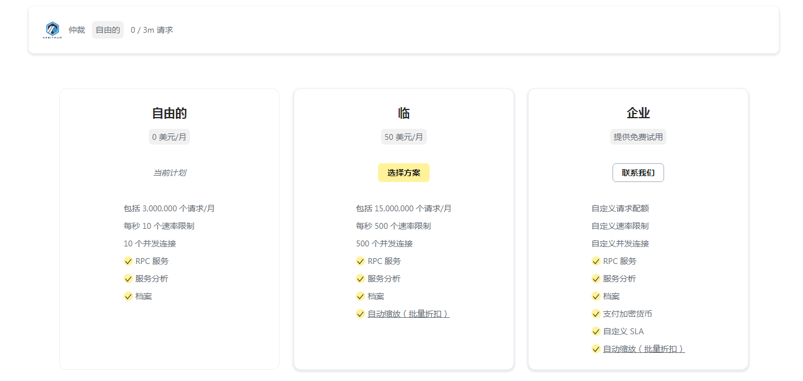

进入[datahub官网](https://datahub.figment.io/auth/login)注册账号

创建新应用:

  

输入名称，环境选项区分应用程序的状态，任意选一个不影响功能，选择arbitrum主网，点击创建应用:

  

点击进入arbitrum:

  

免费版每月有300万数据请求，速度较低，每秒只能支持10次调用请求。

点击复制RPC
进入小狐狸钱包，点击设置--网络--Arbitrum主网--粘贴RPC链接，点击保存，即可成功创建arbitrum-RPC。

亲测可用，不卡，也不算丝滑，跟平时使用马蹄链差不多。

  

付费版本简介，如果需要更大的宽带，与更丝滑的体验，50美金一月。

  

