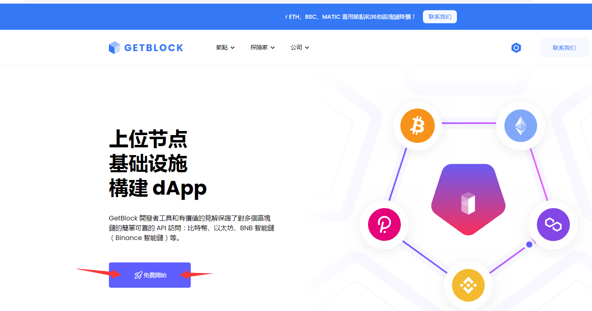
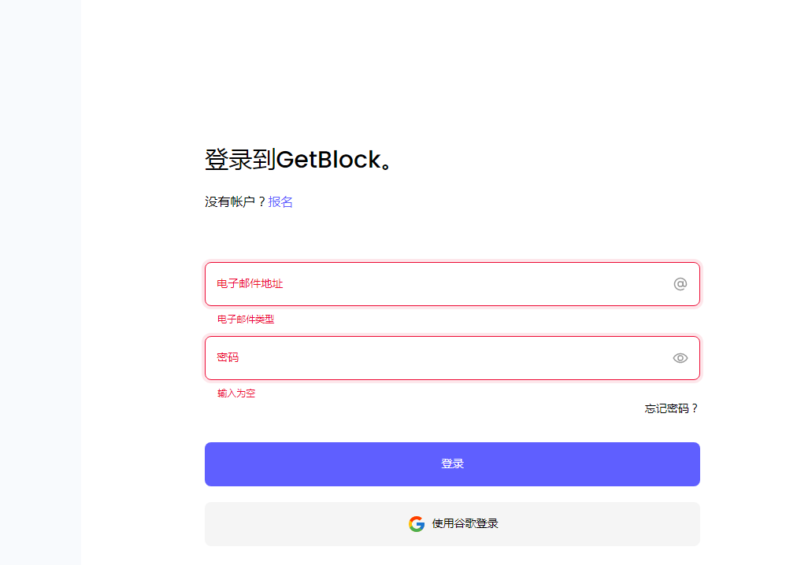
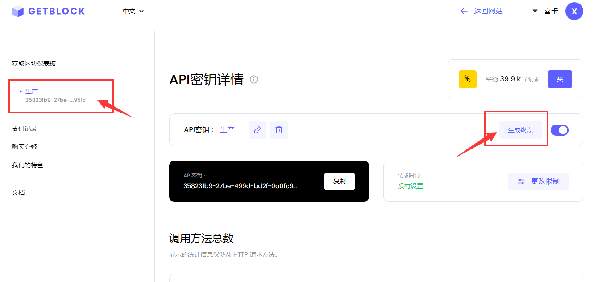
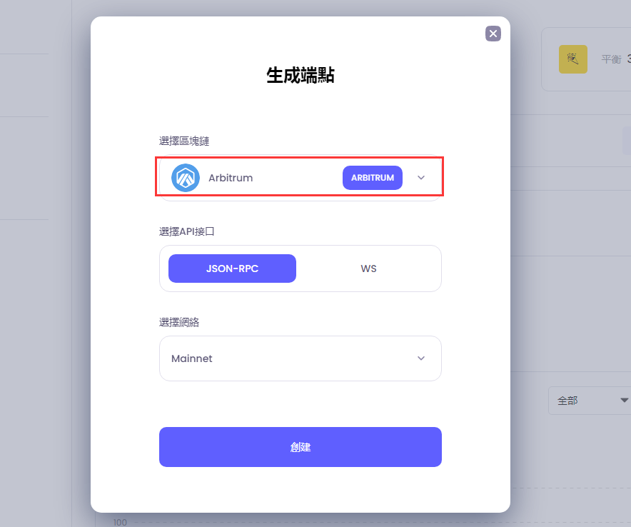
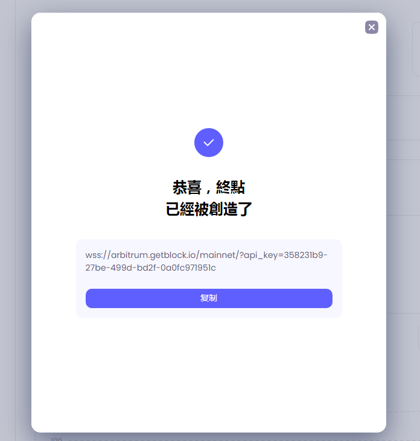
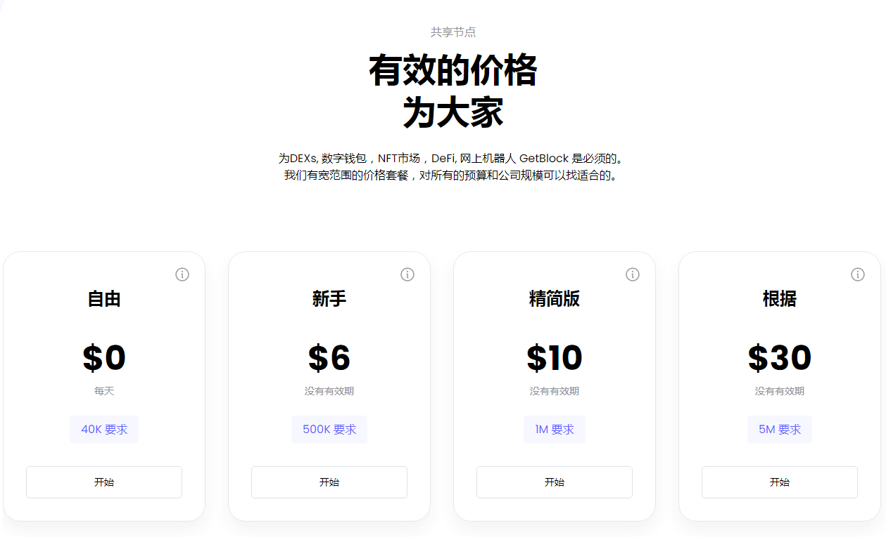

进入 [getblock官网](https://getblock.io/cn/)点击免费使用。

  

注册登录:

  

点击生产，点击生成终点:

  

选择arbitrum主网，点击创建:

  

这是共享节点，每秒支持30次调用请求，会比datahub网络好一点，付费增加计算数据，没有期限，直到用完为止。

专用节点建造，需要专用服务器，才能独享高性高速度，日常交互不必考虑。

  

点击复制RPC
进入小狐狸钱包，点击设置--网络--Arbitrum主网--粘贴RPC链接，点击保存，即可成功创建你的arbitrum-RPC。亲测可用。

觉得好用，可以考虑付费。免费节点可以备用，当没有那么多人使用的时候，切换arb官方节点才是最优选择。

付费续用价格如下：

  

