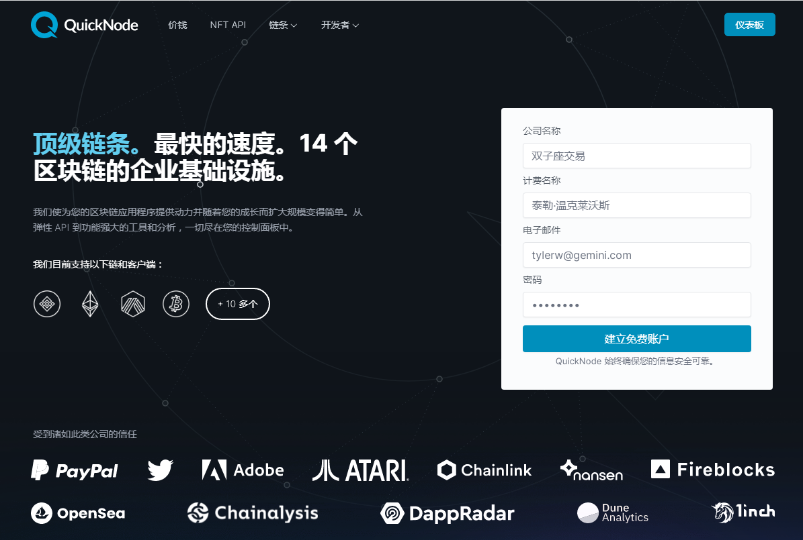
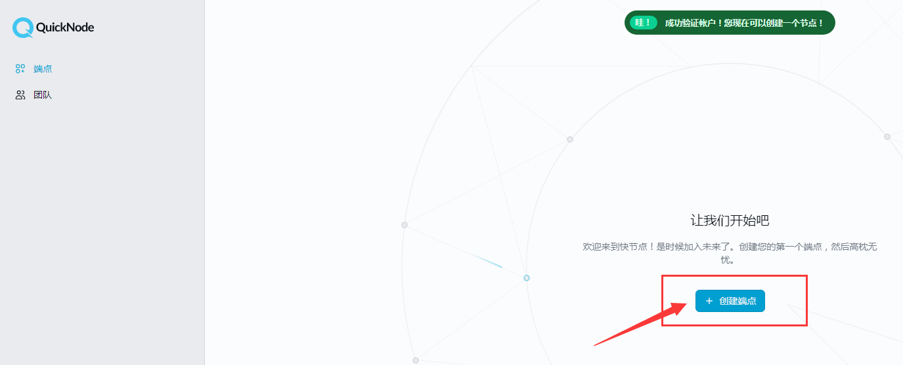
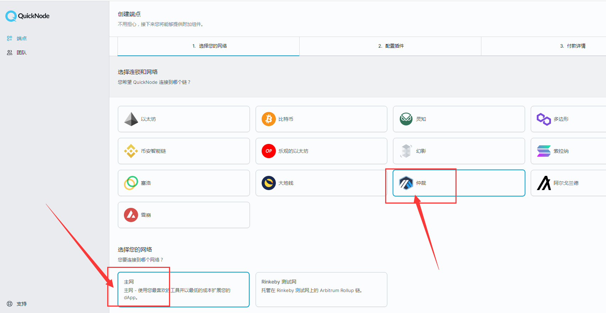
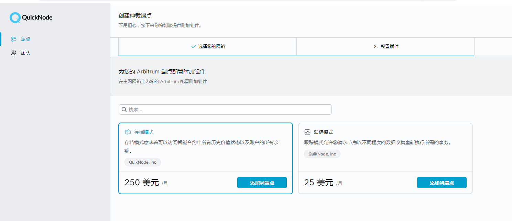
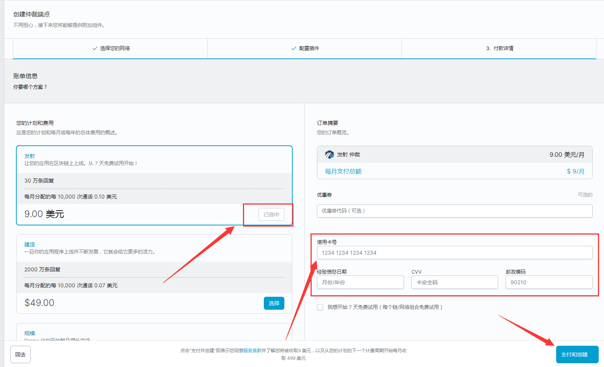
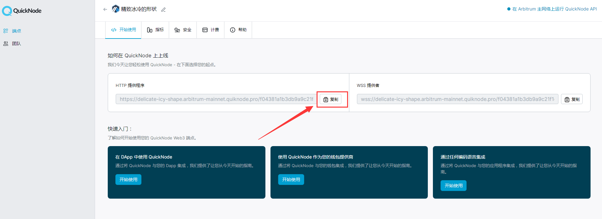

1.进入（快速节点）注册账号，邮箱点击验证账户，此网站支持免费七天试用，无免费版。
点击[quicknode官网](https://www.quicknode.com/)。

  

2.邮箱验证成功，自动跳转此页面，点击创建你的RPC节点。

  

3.选择Arbitrum，选择主网。

  

4.不需要组件，点击继续下一步。

  

5.选择9美元/月，输入信用卡账号，S点击创建。

  

6.复制RPC链接（http开头）
进入小狐狸钱包，点击设置--网络--Arbitrum主网--粘贴RPC链接，点击保存，即可成功创建arbitrum-RPC。Quicknode，免费试用七天将自动扣费，实测服务器网速比其他免费版较快。
注意事项：如果把自己的RPC节点发在群里，让多人使用，超过规定量后，会产生大量扣费。

  

