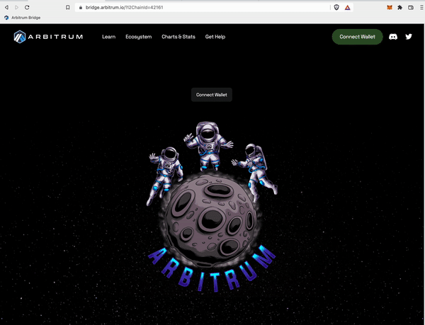
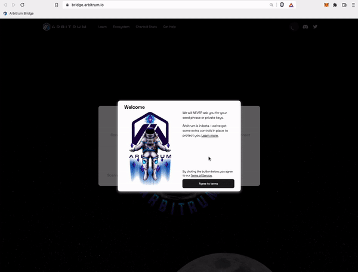
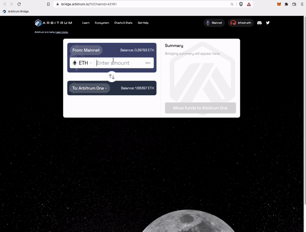
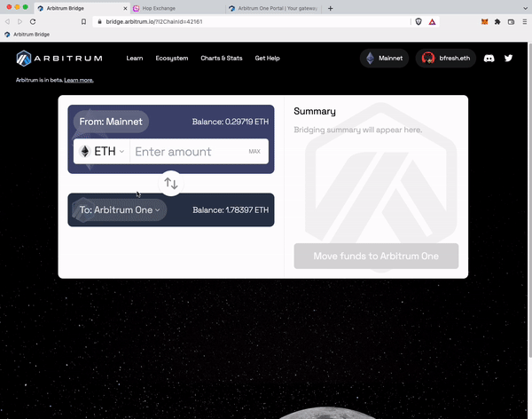
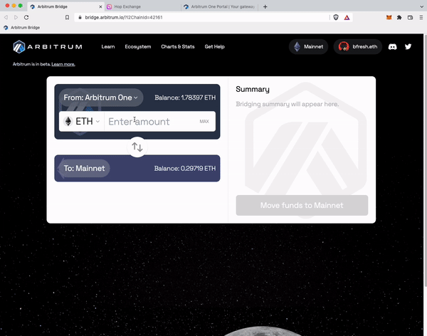
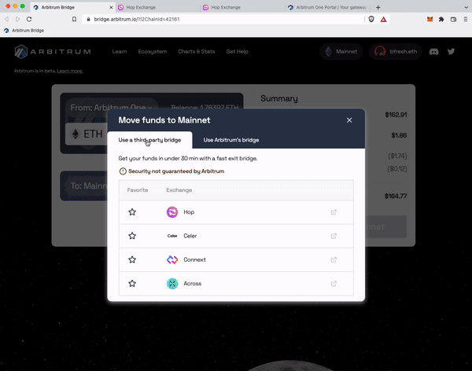
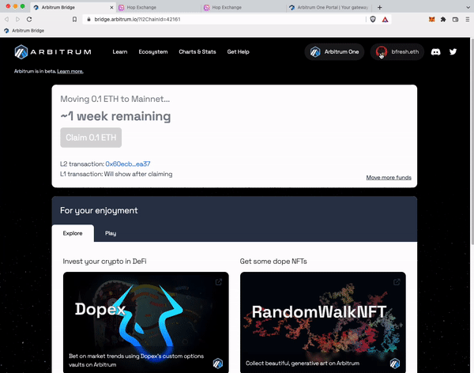
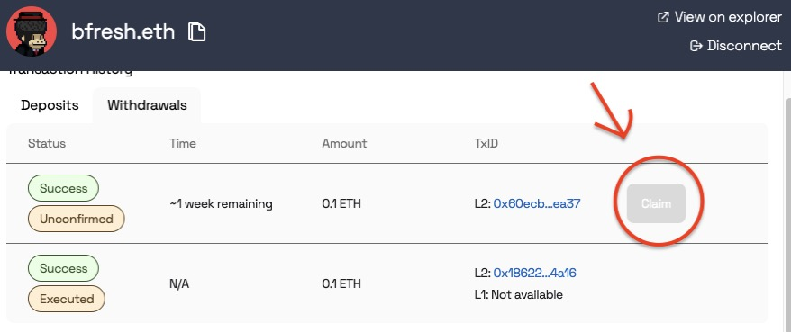

# Arbitrum官方桥教程

本教程的预设是你已经下载了一个像MetaMask这样的web3钱包，并且在以太坊主网上的钱包里有ETH或代币。如果你还没有钱包，请访问我们的portal网站，去下载一个。

注意：ETH是Arbitrum上的gas费结算代币。你需要用ETH在Arbitrum上进行交易！

## 1. 添加一个网络。Arbitrum One或Arbitrum Nova 
	
按照下面的步骤手动添加一个Arbitrum网络。

点击metamask的扩展 > 点击 「Ethereum Mainnet」网络 > 点击菜单末尾的 「Add Network」(添加网络)，并输入你要连接的Arbitrum链的对应信息。

  

---

- Network Name: Arbitrum One
- RPC: https://arb1.arbitrum.io/rpc
- Chain ID: 42161
- Currency Symbol: ETH	 		 			 	
- Block Explorer URL: https://arbiscan.io

---
- Network Name: Arbitrum Nova
- RPC: https://nova.arbitrum.io/rpc
- Chain ID: 42170
- Currency Symbol: ETH
- Block Explorer URL: https://nova-explorer.arbitrum.io

    如果你是一个开发者，你可以使用Alchemy、Infura或Quicknode作为连接到Arbitrum One的替代方式。

    对于Arbitrum Nova，目前你可以使用Quicknode作为替代方式

## 2. 将你的ETH/代币桥接 (L1 —> L2)
	
		 		 			

		 	

    要使用Arbitrum One或Arbitrum Nova的话，你需要首先将资产从以太坊主网桥接到Arbitrum One或Nova上。可以点击这里访问我们的官桥。

1. 用你的钱包登录官桥，并确保你使用的网络是「Ethereum Mainnet」。

    

    
    

2. 请选择你希望桥接到的Arbitrum网络!

    可选Arbitrum One或Arbitrum Nova
		 		 			

  

3. 在下拉菜单中选择你想桥接的代币。			 		 			
    你也可以通过点击下拉菜单右下角的「Manage Token lists」(管理代币列表)按钮，来启用/关闭代币列表。
	

  

4. 在「Mainnet」 (主网) 中输入你想要桥接的ETH/代币数量，然后按「Deposit」(存入)。
    如图，按照Metamask上的提示操作。

    在你通过Metamask提交了交易后，资金在大约10分钟到1小时内会到达Arbitrum One（实际时间取决于拥堵情况）。

    同时，请确保你的MetaMask钱包被设置为Arbitrum One网络 或 Arbitrum Nova网络（取决于你选择桥接哪一个）——这样你就可以在资金到达时看到。

  

 	

## 3. 游览我们的DAPPs

Arbitrum的生态中有非常多的dapp、钱包、工具以及更多的项目！

你可以在这里浏览其中大部分的项目名单：Arbitrum One Portal, Arbitrum Nova Portal
	 		 			

  

	 	

## 4. 提取你的ETH/代币(L2 —> L1)

    请注意：L2回L1至少需要7天的挑战期。

    如果你通过官桥跨回你的资金，在资金能到达主网上并可被领取前，需要等待至少7天的时间，

1. 点击页面中间的箭头，然后在代币的下拉菜单中选择你想要桥接的代币。

    *请确保你连接到的网络是你想跨回资金的Arbitrum网络（Arbitrum One或Arbitrum Nova）。
                                

  

2. (a)我们推荐使用这些跨链桥项目方中的一个!(如图)
	
    根据你想选择哪一个跨链桥项目方，你将会被送到他们桥的页面上，并在那里完成你从Arbitrum的跨回资金。

  

		 	

2.  (b)在「L2」中输入你想要桥接的ETH/代币的数量，然后按 「Withdraw」(提取)。
    如图，按照Metamask上的提示操作。

    请确保你留下足够的ETH来支付这笔交易，否则Metamask界面将不会弹出。

    至少有7天的挑战期。
    一旦你通过桥梁发送你的资金，你将不得不等待至少7天，直到你在主网上收到它们。

    请注意：L2回L1至少需要7天的挑战期。

    如果你通过官桥跨回你的资金，在资金能到达主网上并可被领取前，需要等待至少7天的时间。
	

  

	

3. 完成以上操作后，会弹出一个倒计时，显示你会在7-8天内得到你的资金。

    你可以通过点击右上方的「个人资料」来检查你资金的提取状态——跨回完毕后，也是在此界面中领取你的资金。		

  

4. 一旦倒计时结束，在你钱包上切换到以太坊主网网络，按一下现在已变成蓝色的「Claim」 (认领)按钮，这样可以领取你的资金了! 	
		 		 			

  

	 	

## 潜在的风险

- 智能合约风险：任何智能合约都有可能存在漏洞，从而导致用户资金的损失。

- 价格风险：一旦你的ETH或代币从L1→L2或L2→L1被桥接，你的资金价值可能会因为定期的市场波动而发生变化。

