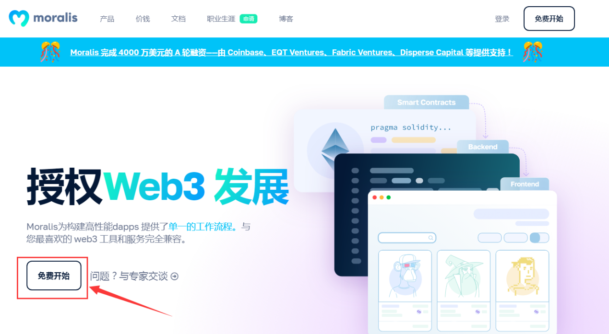
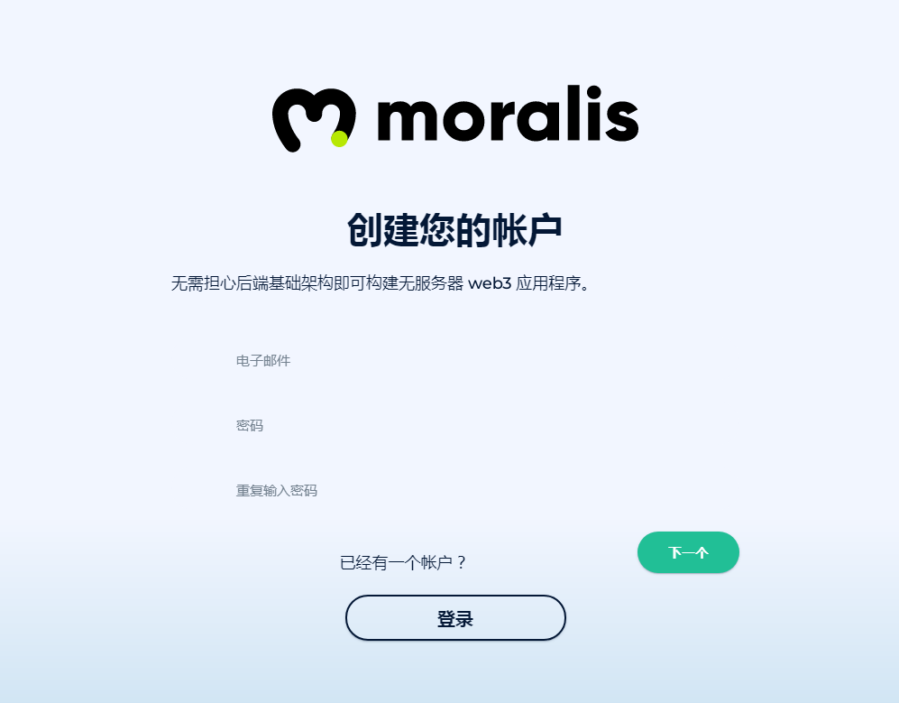
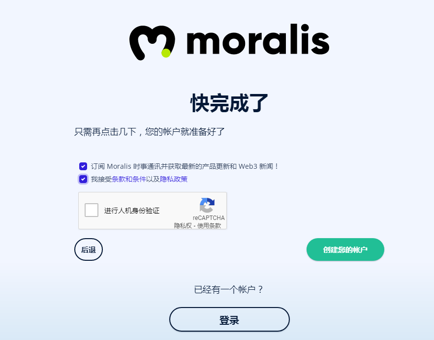
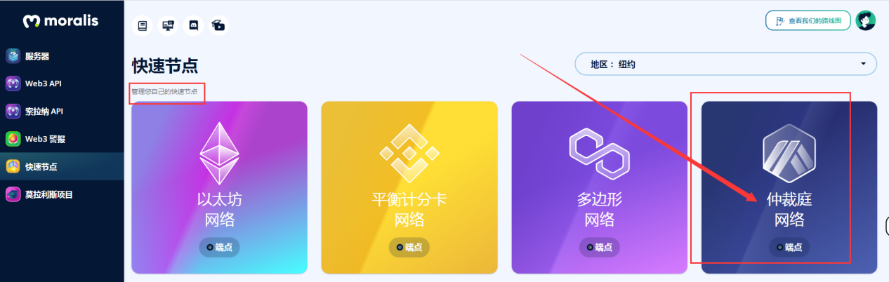
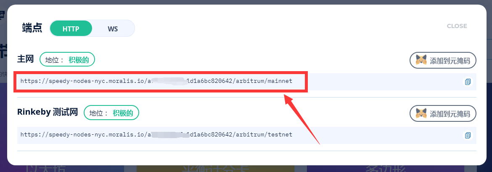
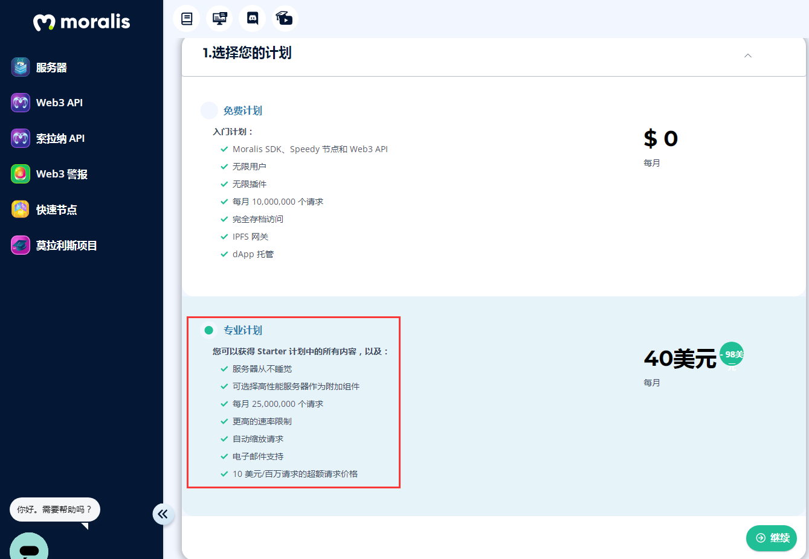

1.进入[moralis官网](https://moralis.io/)，点击免费开始。

  

2.注册账号

  

3.填写调查表

  

4.勾选订阅，接受条款，进行人机验证，创建你的账户

  

5.验证邮箱账户完成，自动生成RPC节点，点击快速节点（管理你自己的节点），点击arbitrum网络。

  

6.看到自己的RPC(HTTP地址)，官方提醒手动添加到钱包（由于metamask发生错误，自动添加失效）

注意事项：鼠标选中链接，右键复制，不要点击最右边的复制图标。

  

7.专业计划40美元/月，服务器永不停机，增加RPC速率性能等等...

  

