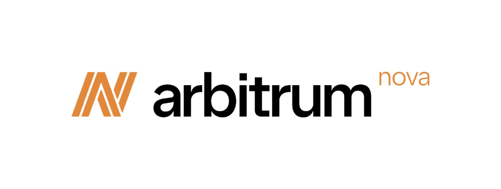

# 是时候迎接新的曙光了，Nova正式对公众开放了!
言简意赅： Nova现在向公众开放了! Reddit在Nova上推出了他们的社区积分系统。

- 从[这里](https://bridge.arbitrum.io/?l2ChainId=42161)跨入Nova！
- 从[这里](https://nova.arbitrum.io/)了解更多关于Nova的信息！
- 从[这里](https://developer.offchainlabs.com/docs/Public_Chains)开始在Nova上进行建设！

诸位Arbinauts快来集合! Arbitrum Nova的大门现在正式开放了!

是的，你没有看错 - 从今天起，我们已经换下了Nova的开发者白名单。Nova是我们最新开发的链，主要用于游戏和社交应用，是我们的第一个建立在AnyTrust技术上的链。现在欢迎用户和更多的建设者们来体验并开发Nova。

你在这里桥接Nova，并通过访问我们的网站了解更多关于Nova的信息。

  

在我们最初的公告中，我们分享了我们的理念：Nova将完美适应游戏和社交项目的需求——即交易量非常大，寻求将成本降到更低，但仍然需要高安全性的项目。在过去的几周里，我们看到了生态中的很多团队对Nova表达出了足够的兴趣，作为我们公平发布过程的一部分，我们授予了100多个开发团队以访问权。

我们还非常兴奋地想要分享：今天(8月9日)，就在我们的Nova链公开发布的同时，Reddit正在向Nova部署他们的社区积分系统，从两个社区开始，你可以在这里阅读更多关于他们发展的旅程。
Reddit的旅程，从烘焙比赛到部署至主网，无疑加强了我们的信念——即Arbitrum技术栈是开发者的最佳扩展解决方案，不仅仅是在以太坊主网，而是在整个区块链领域。

对于Arbitrum的社区来说，这已经是，并将继续是一个重要的月份。上周，我们宣布了我们的主网迁移计划——在了8月31日，我们将Arbitrum One升级至Nitro。而今天我们又向大众开放了一条全新的链，它将成为Reddit社区积分系统的大本营，这是一个全新将社区带入链上的模式。我们还有更多关于Nova的信息想要分享，包括我们的数据可用性委员会(DAC)的成员，以及开始建设的最佳方式，但是说了这么多......

欢迎来到「Arbitrum八月」!

## 首届 数据可用性委员会(DAC)
我们已经提到了Nova可以为项目提供超低的交易成本，并将使用DAC。今天我们想分享一下委员会的首届成员

这是一个由业内最好的团队共同组成的委员会，他们包括：
- Consensys
- FTX
- Google Cloud
- Offchain Labs
- P2P
- Quicknode
- Reddit

我们很高兴能与这些团队合作，因为他们都是发布了，已经影响了大量用户群的「弹性技术」的组织，这也是我们希望通过Nova去实现的，而且他们也相信web3的前景。 随着时间的推移，委员会将不断扩大，我们期待随着事情的进展，将有机会与社区分享更多的细节。

## 开始使用Nova
所以你想在Nova上进行开发？很高兴你有这个兴趣并同时已经准备就绪了！你可以在[这里](https://nova.arbitrum.io/)了解更多关于Nova的运作原理。以下是一个快速的入门指南。

1. 首先，你可以使用[Arbitrum官桥](https://bridge.arbitrum.io)跨入Nova——现在支持在Arbitrum Nova和Arbitrum One之间轻松地进行网络切换。我们希望这将使在以太坊主网和我们的链之间的交互更加简单和便于操作。

2. 接下来，如果你想提前在测试网上部署，我们强烈建议使用Arbitrum Goerli，因为这将是我们未来的长期测试网。除了交易费用金额，Goerli和Nova之间的开发体验将是完全相同的，因为两者都是建立在Nitro技术之上的

3. 最后，在Nova上部署也很简单，只要把你的rpc端点和ChainID配置到nova链上，分别是nova.arbitrum.io/rpc和42170 - 你可以在[这里](https://developer.offchainlabs.com/docs/Public_Chains)找到这些，以及更多有关链的细节内容。对于新的开发者，你可以从我们的[教程](https://developer.offchainlabs.com/docs/Tutorials)开始，并加入我们的discord，有很多Arbitrum的开发者经常在那里互帮互助。
